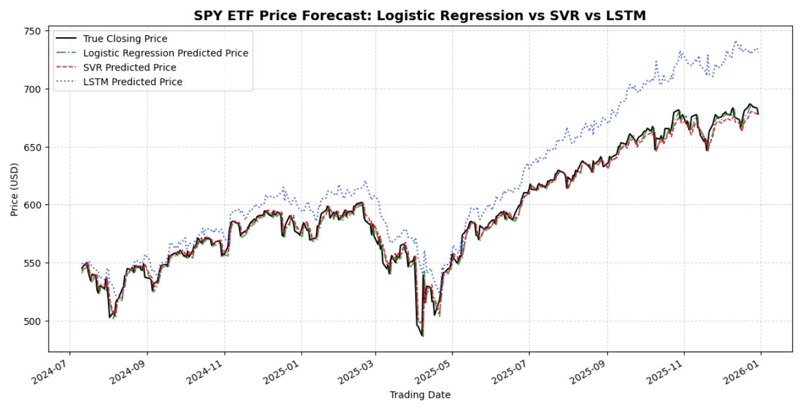

# SPY ETF Stock Price Forecasting & Algorithmic Trading Backtesting
## Project Overview
An end-to-end quantitative finance pipeline built with Python, predicting next-day closing prices of SPY (S&P 500 ETF) via 3 machine learning models:
1. Logistic Regression (binary classification for bullish/bearish signals)
2. SVR Support Vector Regression (direct continuous price prediction)
3. LSTM Recurrent Neural Network (time-series deep learning forecasting)

After model evaluation with RMSE and R² metrics, we build a long-only trading strategy based on SVR predicted returns, and implement lightweight manual backtesting to calculate core risk-return indicators: total cumulative return, annualized Sharpe ratio, maximum drawdown.

**Key Features
- Historical US ETF data download via AkShare
- Technical feature engineering: 10-day & 50-day moving averages
- Strict chronological train/test split (85% train / 15% test, no shuffle to avoid data leakage)
- MinMax normalization for regression and deep learning inputs
- Cross-model prediction visualization
- Full error handling for network, TensorFlow and training exceptions
- Pure manual backtesting (removed backtrader to eliminate environment compatibility errors)
- No Chinese font dependency, compatible with Windows / macOS / Linux / Kaggle

**SPY ETF Price Forecast**


**Environment Setup**
```bash
pip install -r requirements.txt
python stock_prediction.py

## Project Demo
Kaggle Interactive Notebook: https://www.kaggle.com/code/jenniferxfl/stock-price-forecasting-algorithmic-backtesting
